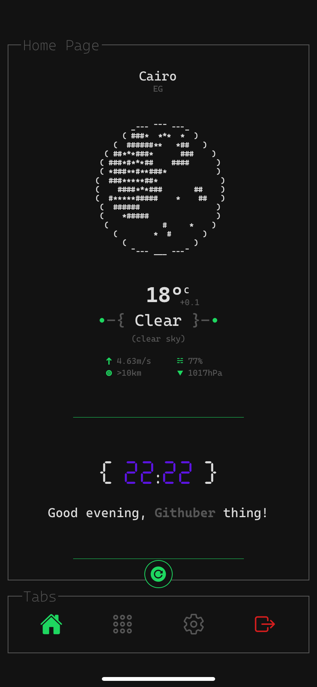
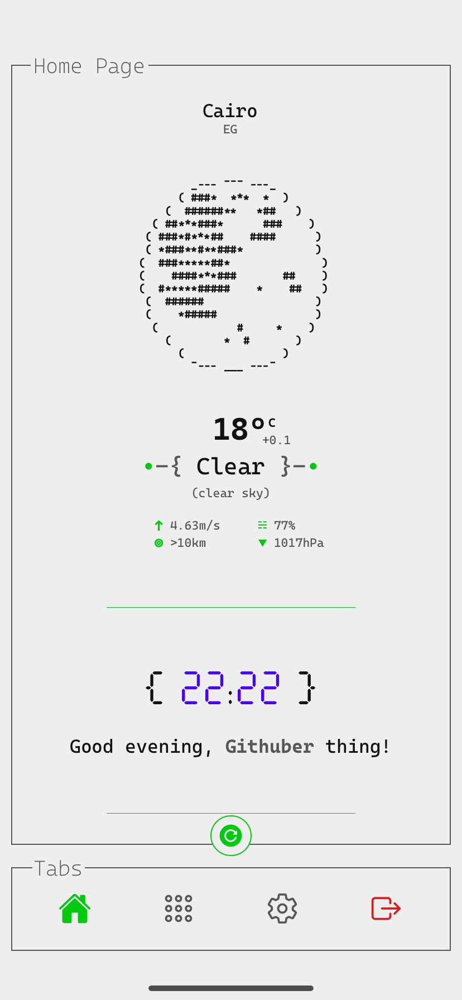
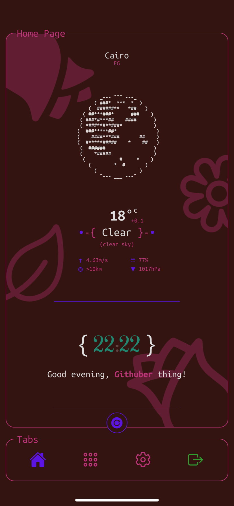
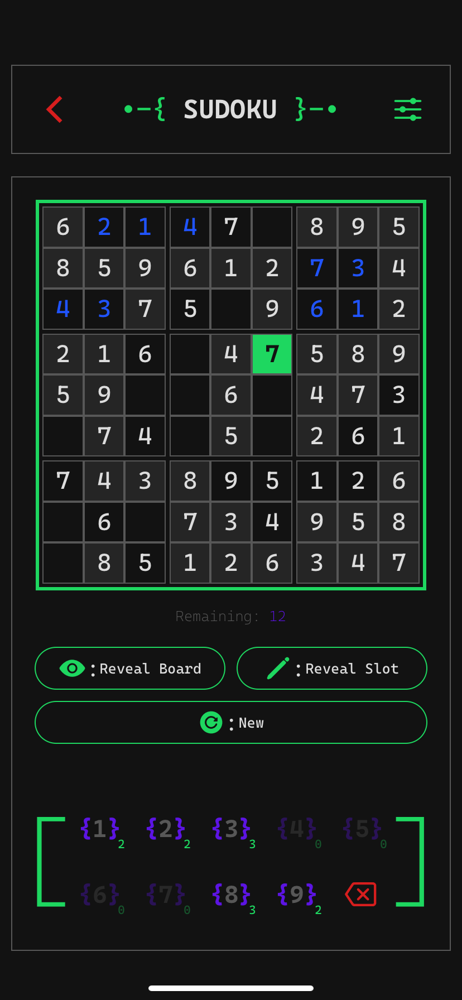
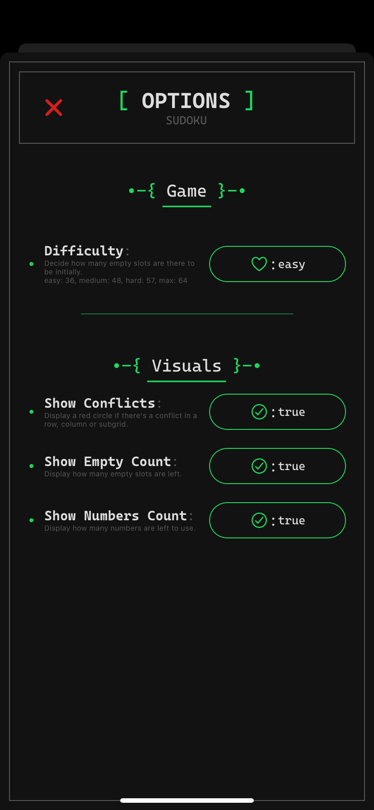

  
  <h1 align="center" style="font-family: monospace">
    •-{ Tuii }-•
  </h1>

**`Tuii`** (stylized as `{ Tuii }` or `{+}`) is a multipurpose app with random features and stuff.
&#10;
It's made with **React Native Expo** and works on all that Expo works on _(namely; Android, iOS, Web)_

## Style

Tuii resembles that of old text-based user interfaces—yes, that's why it's called Tuii—but with a modern sleek look to it.
It also comes with different themes to choose from, so choose what suits you and your liking best!
&#10;
I mean just look at these:

  
  
  

<h3 align="center">
  Dark | Light | Scarlatta
</h3>

## Home Page

It offers simple stuff like current weather, a clock, Word of The Day and Today's Quote!

## Applets

Currently all there is is Sudoku but of course there will be more to come!
&#10;

### Sudoku

You can mark slots, reveal them _(if you're a loser)_, decide whether conflicts should be highlighted, or if you can see how many of each number is remaining, or how many empty slots are there.
&#10;
You can also be shamed if you don't do effort! How amazing!
The world needs more mean bullying! **:D**

  
  

## References

- [OpenWeatherMap](https://openweathermap.org/)
- [FreeDictionaryAPI](https://dictionaryapi.dev/)
