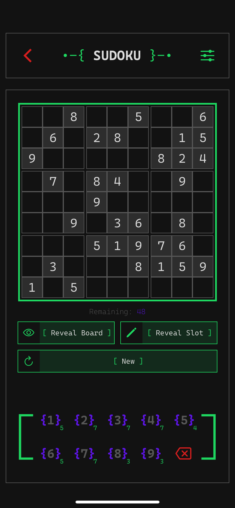
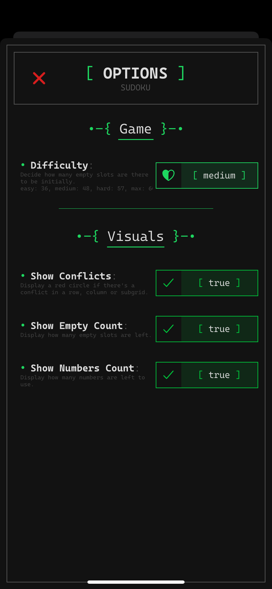

  
  <h1 align="center" style="font-family: monospace">
    •-{ Tuii }-•
  </h1>

**`Tuii`** (pronounced `/tou·wee/`; stylized `{ Tuii }` or `{+}`) is a multipurpose app with random features and stuff.
 
It's made with **React Native Expo** and works on all that Expo works on _(namely; Android, iOS, Web)_

## Style

Tuii resembles that of old text-based user interfaces—yes, that's why it's called Tuii—but with a modern sleek look to it.
It also comes with different themes to choose from, so choose what suits you and your liking best!
 
I mean just look at these:

  
  
  
  

Dark | Light | Scarlatta | E9999

## Home Page

It offers simple stuff like current weather, a clock, Word of The Day card and Today's Quote card!

  

Weather

  

Clock

  

Cards

In order to customize it more take a look at the [settings](#settings).

## Applets

Currently, all there is is [Sudoku](#-sudoku) and [TicTacToe](#-tictactoe), but expect more to come!

### • Sudoku

You can mark slots, reveal them _(if you're a loser)_, decide whether conflicts should be highlighted, or if you can see how many of each number is remaining, or how many empty slots are there.
 
You can also be shamed if you don't do effort! How amazing!
The world needs more mean bullying! **:D**

  
  

### • TicTacToe

Whether you call it tic-tac-toe, noughts and crosses _(WTF are you if you call it that)_, X/O or Xs & Os. I don't believe it needs to be described; you know it already _(unless you're a loser)_.
 
You can adjust the difficulty and whether you play against the CPU or play with yourself... not- uhh, you know what I meant, goddammit.

  
  

## Settings

This is where you customize and adjust stuff as you like. It kind of looks like this:

  

## References

- [OpenWeatherMap](https://openweathermap.org/): for fetching weather in the main menu.
- [FreeDictionaryAPI](https://dictionaryapi.dev/): for fetching word of the day meaning in the main menu.

 
 

_(these screenshots were taken on an iPhone 11, but it should be roughly the same everywhere else)_
