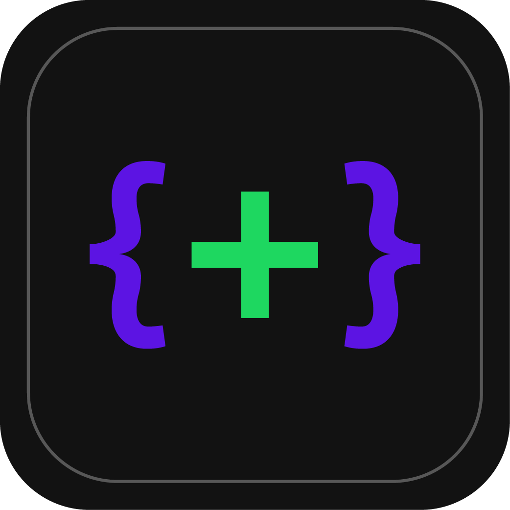

  
  <h1 align="center" style="font-family: monospace">•-{ Tuii }-•</h1>

**Tuii** is a multipurpose app with random features and stuff.
 
It's made with **React Native Expo** and works on all that Expo works on _(namely; Android, iOS, Web)_

## Style

Tuii resembles that of old text-based user interfaces—yes, that's why it's called Tuii—but with a modern sleek look to it.
It also comes with different themes to choose from, so choose what suits you and your liking best!
 
I mean just look at these:

  
  
  

<h3 align="center">
  Dark | Light | Scarlatta
</h3>
